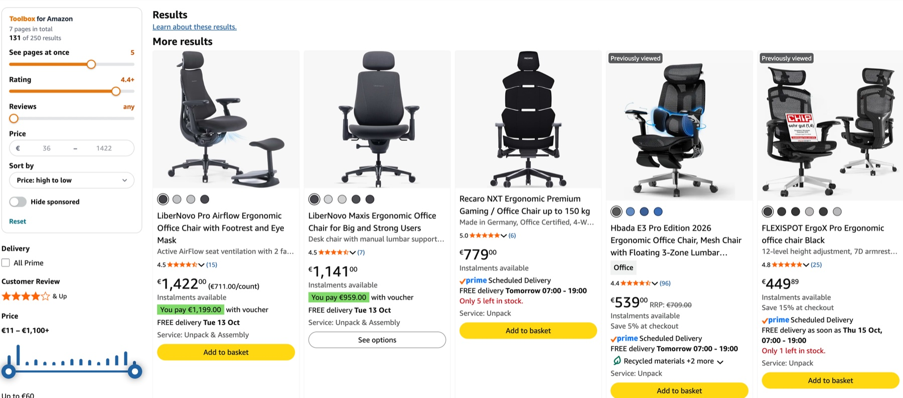
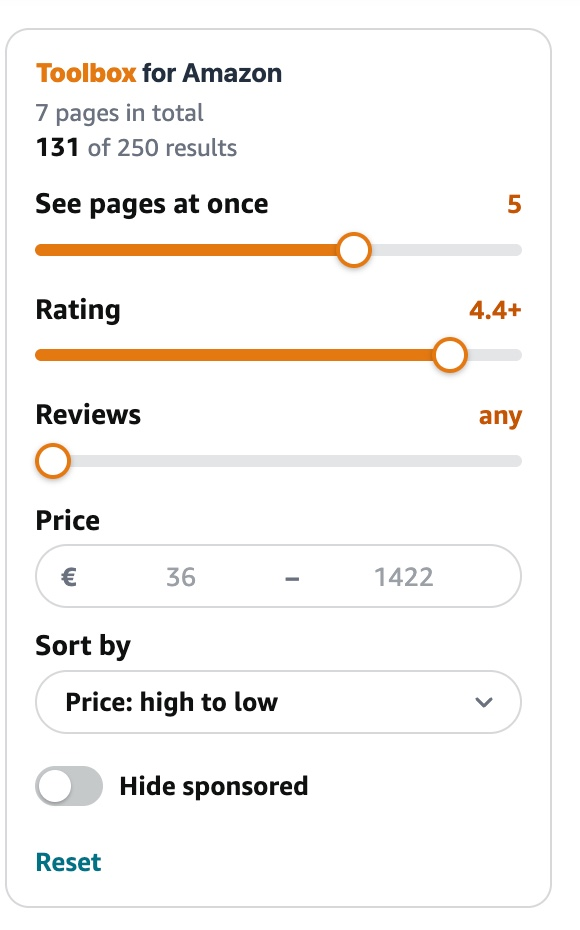
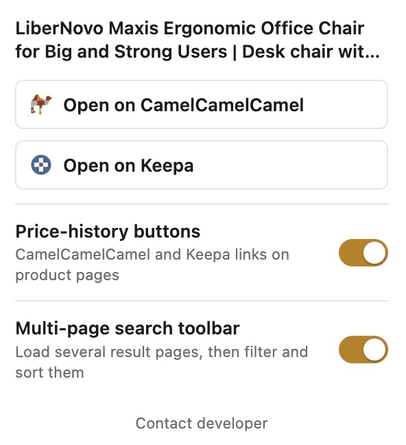
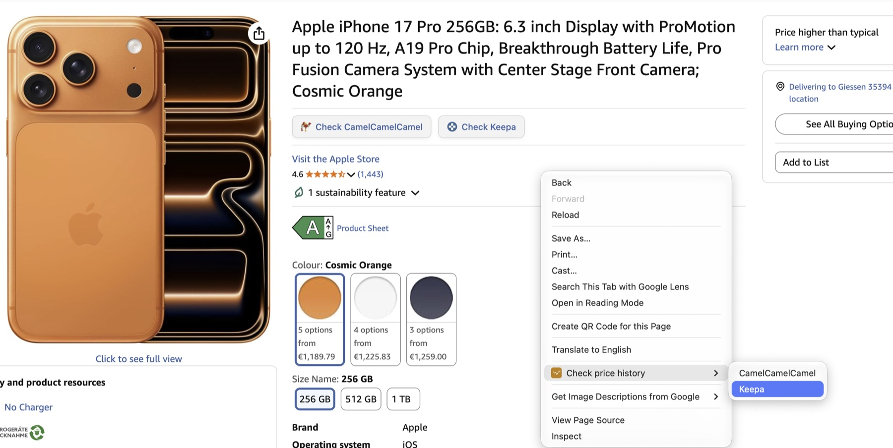
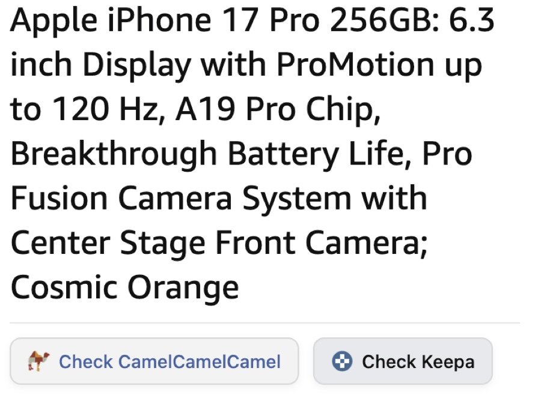
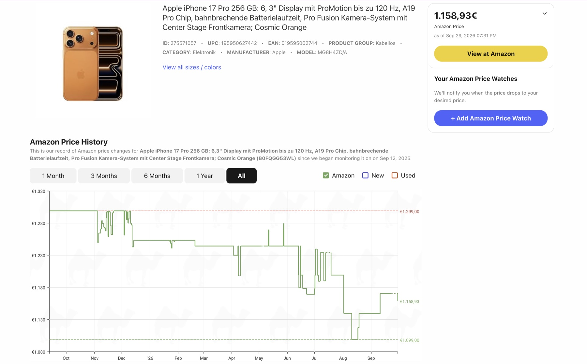
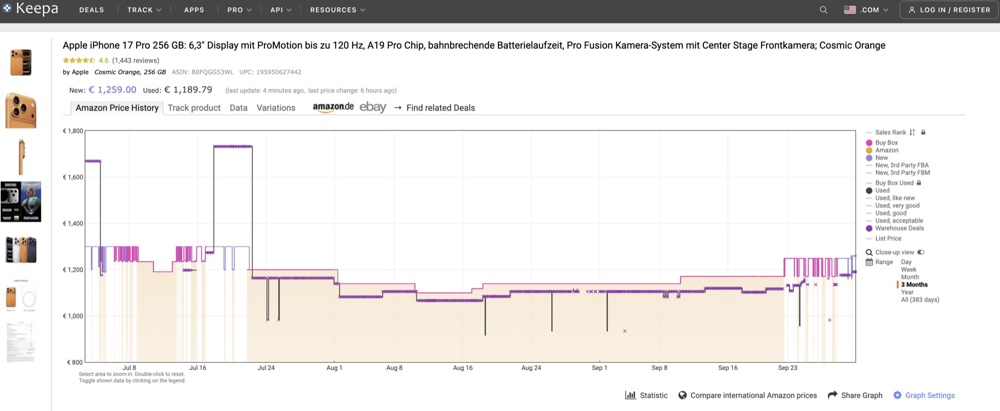

# Toolbox for Amazon

**[➕ Add to Chrome — free](https://chromewebstore.google.com/detail/fdebpchoageihbdifaiallkcipeooaoo)** · [Watch the 36-second demo](https://www.youtube.com/watch?v=_BUUSi_Evqk)

A tiny, dependency-free Chrome extension with two tools for Amazon:

- **Multi-page search results.** Amazon shows one page at a time. On any search
  page, a toolbar loads as many pages as you like into one grid, then lets you
  filter by rating, reviews and price and sort the combined list.
- **Price history in one click.** On any product page, jump straight to that
  exact product's price history on
  [CamelCamelCamel](https://camelcamelcamel.com) and [Keepa](https://keepa.com)
  — no searching, no typing.

## Search toolbar

| Control | What it does |
| --- | --- |
| **See pages at once** | How many result pages to show together (default 5, max 30). |
| **Rating** / **Reviews** | Hide products below this star rating / review count. |
| **Price** | Min / max price; the placeholders show the range in the current results. |
| **Sort** | Featured, best rated, price, rating or most reviews — across all loaded pages. |
| **Hide sponsored** | Drops sponsored cards. |

Works on 22 Amazon marketplaces. Turn it off any time from the toolbar popup.

<p align="center">
  
  <br><em>The panel sits above Amazon's own filters — here 5 pages are loaded together, filtered to 4.4★ and up, sorted by price</em>
</p>

<p align="center">
  
  <br><em>Panel close-up</em>
</p>

## Settings

<p align="center">
  
  <br><em>Toolbar popup: jump to price history, and turn each tool on or off</em>
</p>

## Price history screenshots

<p align="center">
  
  <br><em>Right-click context menu</em>
</p>

<p align="center">
  
  <br><em>Buttons injected next to the price on any Amazon product page</em>
</p>

<p align="center">
  
  &nbsp;
  
  <br><em>Results on CamelCamelCamel (left) and Keepa (right)</em>
</p>

## Why

Amazon doesn't show price history, and CamelCamelCamel/Keepa don't offer a
free API a browser extension can call directly. So instead of scraping
either site, this extension does the one thing it legitimately can: parse the
ASIN out of the Amazon URL you're already on and build the direct link to
that product's page on each service.

## Install

**[➕ Add to Chrome — free](https://chromewebstore.google.com/detail/fdebpchoageihbdifaiallkcipeooaoo)**, then click **Add extension**. That's it — no setup, no account.

Once installed, open any Amazon search page to see the panel, or any product
page for the price-history buttons. The toolbar icon opens the settings.

## Use: price history

- On any Amazon product page, **Check CamelCamelCamel** / **Check Keepa** buttons
  appear right next to the price — click one to open that product's page on
  each site in a new tab. Toggle these off from the popup if you'd rather not
  see them.
- Click the toolbar icon → two buttons do the same thing from the popup.
- Or right-click anywhere on the page → **Check price history** → **CamelCamelCamel** / **Keepa**.

## Supported marketplaces (price history)

amazon.com, .co.uk, .de, .fr, .co.jp, .ca, .it, .es, .in, .com.mx, .com.au
(CamelCamelCamel only covers a subset of these; Keepa covers all of them).

## Privacy

Collects nothing. Reads the active tab's URL to build the two links — either
when you click the icon/menu, or, on Amazon product pages, to place the
inline buttons next to the price. The search toolbar only talks to Amazon
itself (to fetch the extra result pages you ask for). Saved locally via the
`storage` permission: your on/off preferences and the toolbar's last-used
settings. No analytics, no telemetry, no server. Full policy:
[PRIVACY.md](PRIVACY.md).

## Development

Written in TypeScript (strict), bundled with [esbuild](https://esbuild.github.io/) into `dist/`, which is the
extension Chrome loads. The shipped extension has no runtime dependencies.

```sh
npm install
npm run build      # bundle into dist/
npm run watch      # rebuild on change
npm run check      # type-check + build + all tests
npm run package    # type-check, build, and zip dist/ into release/ for the Web Store
```

To try a local build, open `chrome://extensions`, enable Developer mode and load the `dist/` folder.
Needs Node 22.18 or newer (tests run TypeScript directly).

### Project structure

| Path | Purpose |
| --- | --- |
| `src/search.ts` | Search-results script: reads the cards, loads more pages (politely), and drives the toolbar |
| `src/toolbar.ts` | The panel itself: a view that draws whatever state it's given, plus its stylesheet |
| `src/lib.ts` | Pure logic with no browser APIs: price/rating/review parsing, sorting, filtering, settings validation |
| `src/sites.ts` | Amazon → CamelCamelCamel / Keepa URL mapping and ASIN parsing |
| `src/content.ts` | Product pages: the CamelCamelCamel / Keepa buttons next to the price |
| `src/background.ts` | Right-click menu and toolbar icon state |
| `src/popup.ts` | Toolbar popup |
| `src/flags.ts` | The two on/off switches, shared by the popup and the content scripts |
| `manifest.json`, `popup.html`, `*.css`, `icons/` | Static files, copied as they are into `dist/` |
| `test/` | Unit tests for `lib.ts` and `sites.ts`, and an end-to-end test that runs the built bundle against a fake Amazon page |
| `scripts/` | Build and packaging scripts |
| `promo/assets/` | Screenshots used in this README and store listings |

## Changelog

See [CHANGELOG.md](CHANGELOG.md).

## License

MIT — see [LICENSE](LICENSE).

Not affiliated with, endorsed by, or sponsored by Amazon, CamelCamelCamel, or
Keepa.
