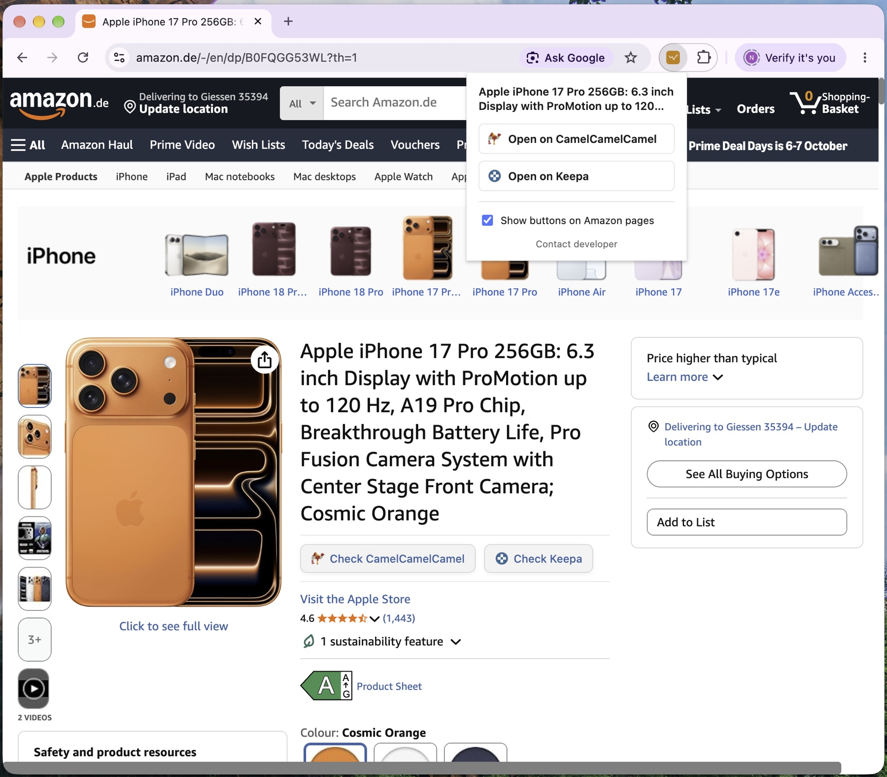
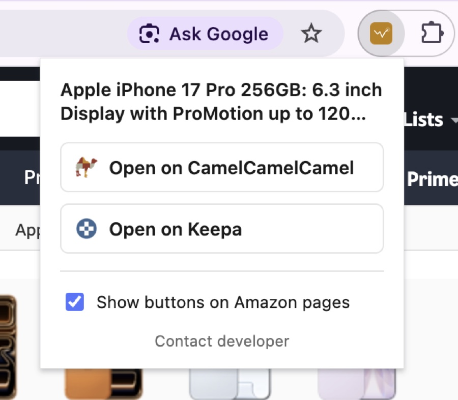

# Price History for Amazon

A tiny Chrome extension. Click its icon (or right-click) on any Amazon product
page and it opens that exact product's price-history page on
[CamelCamelCamel](https://camelcamelcamel.com) and [Keepa](https://keepa.com)
— no searching, no typing.

[Watch the 36-second demo](https://www.youtube.com/watch?v=_BUUSi_Evqk)

## Screenshots

  
   <em>Toolbar popup on an Amazon product page</em>

  
   <em>Popup closeup</em>

  
   <em>Right-click context menu</em>

  
   <em>Buttons injected next to the price on any Amazon product page</em>

  
  &nbsp;
  
   <em>Results on CamelCamelCamel (left) and Keepa (right)</em>

## Why

Amazon doesn't show price history, and CamelCamelCamel/Keepa don't offer a
free API a browser extension can call directly. So instead of scraping
either site, this extension does the one thing it legitimately can: parse the
ASIN out of the Amazon URL you're already on and build the direct link to
that product's page on each service.

## Install

**Chrome Web Store** — submission in review. Until it's live, load it unpacked:

1. Clone this repo.
2. Go to `chrome://extensions`, enable **Developer mode**.
3. Click **Load unpacked**, select this folder.

## Use

- On any Amazon product page, **Check CamelCamelCamel** / **Check Keepa** buttons
  appear right next to the price — click one to open that product's page on
  each site in a new tab. Toggle these off from the popup if you'd rather not
  see them.
- Click the toolbar icon → two buttons do the same thing from the popup.
- Or right-click anywhere on the page → **Check price history** → **CamelCamelCamel** / **Keepa**.

## Supported marketplaces

amazon.com, .co.uk, .de, .fr, .co.jp, .ca, .it, .es, .in, .com.mx, .com.au
(CamelCamelCamel only covers a subset of these; Keepa covers all of them).

## Privacy

Collects nothing. Reads the active tab's URL to build the two links — either
when you click the icon/menu, or, on Amazon product pages, to place the
inline buttons next to the price. The only thing saved is your on/off
preference for those inline buttons, stored locally via the `storage`
permission. No analytics, no telemetry, no server. Full policy:
[PRIVACY.md](PRIVACY.md).

## Project structure

| File | Purpose |
|---|---|
| `manifest.json` | Extension manifest (Manifest V3) |
| `sites.js` | Amazon → CamelCamelCamel/Keepa URL mapping and ASIN parsing |
| `popup.html` / `popup.js` | Toolbar popup |
| `background.js` | Right-click context menu and toolbar icon state |
| `content.js` / `content.css` | Injects the buttons next to the price on product pages |
| `icons/` | Toolbar/store icons and bundled attribution favicons |
| `promo/assets/` | Screenshots used in this README and store listings |

## Changelog

See [CHANGELOG.md](CHANGELOG.md).

## License

MIT — see [LICENSE](LICENSE).

Not affiliated with, endorsed by, or sponsored by Amazon, CamelCamelCamel, or
Keepa.
